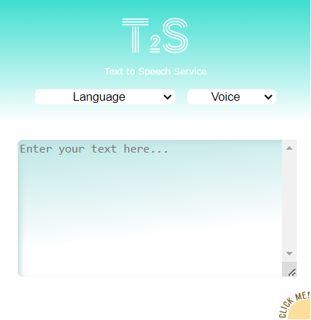
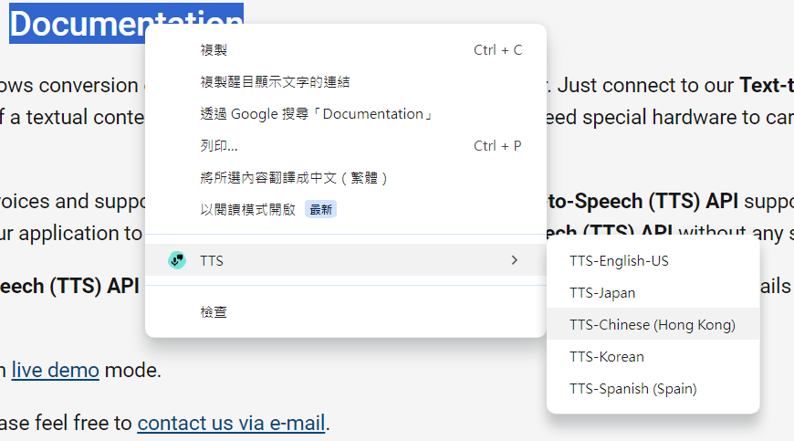

# Chrome Extension - Text To Speech (T2S)

The Chrome Extension - Text To Speech (T2S) is a powerful tool that allows users to convert text into speech. Users can input text and choose their preferred language and voice for the speech output. Additionally, the extension provides a convenient way to read out text content on websites by simply highlighting the desired text and selecting the option from the right-click menu.

## Installation

To install the T2S, you can follow these steps:

1. Download the extension files from the GitHub repository [here](https://github.com/Woohoowee/Chrome-Extension-Project/tree/main/T2S). You can click on the "Code" button and select "Download ZIP" to get the files.

2. Extract the downloaded ZIP file to a convenient location on your computer.

3. Open Google Chrome and type `chrome://extensions` in the address bar.

4. Enable the "Developer mode" toggle switch located in the top-right corner of the extensions page.

5. Click on the "Load unpacked" button.

6. In the file selection dialog, navigate to the extracted folder of the extension (T2S) and click "Select folder" to load the extension.

7. T2S will now be added to your Chrome browser.

## Usage

Please refer to the [Usage Guide](./readme_elements/USAGE.md) for detailed instructions on how to use the extension effectively.

## Features

- Convert user-inputted text into speech using the chosen language and voice.
- Read out text content on websites by highlighting and selecting the option from the right-click menu.

## Configuration

T2S does not provide customization options beyond language and voice selection. Users can choose their preferred language and voice from the extension's pop-up window.

## Web Scraper

To retrieve the necessary data for text-to-speech conversion, the extension utilizes a web scraper to access an API provider. This allows the extension to fetch the required content and generate the speech output accurately.

## Contributing

Contributions to the T2S project are welcome! If you encounter any bugs, have feature requests, or would like to contribute code, please feel free to reach out to us at [hothehuman@gmail.com](mailto:hothehuman@gmail.com).

## License

This Chrome extension is released under the [MIT License](./readme_elements/LICENSE.md).

## Contact and Support

For any questions, issues, or suggestions, please feel free to reach out to us at [hothehuman@gmail.com](mailto:hothehuman@gmail.com).

## Version History

### Version 1.0

- Initial release of the Chrome Extension - Text To Speech (T2S).