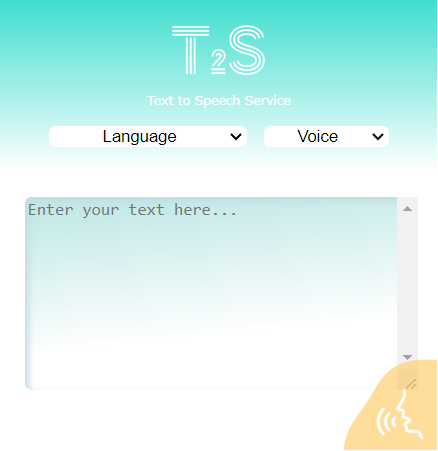
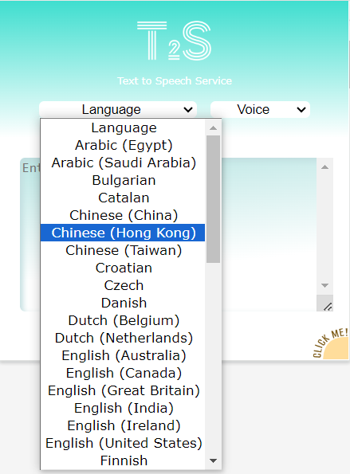
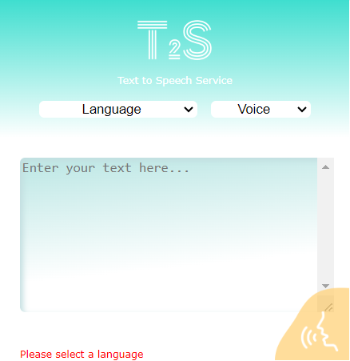
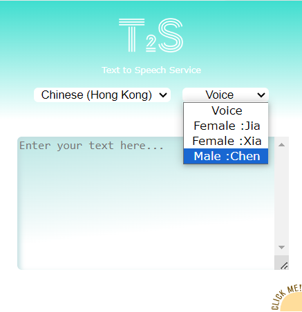
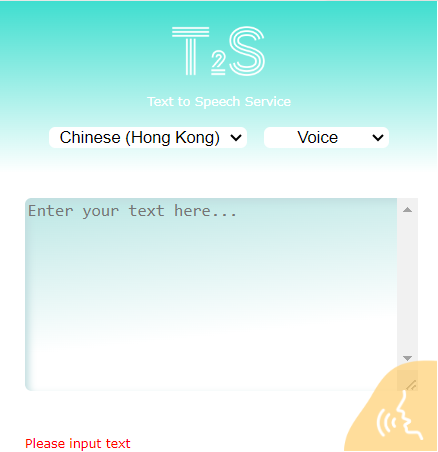

# The User Interface

# Language Options

* The T2S extension supports 49 languages.
* User can select a language from the drop-down menu.

* The T2S extension requires the user to select a language option before the convertion excecute.
* If the user run the extension without choosing any language, a error message will be shown on the bottom.

# Voice Options

* After selecting a language, user can choose their preferred voice to read out the text.
* It is not a must to select a voice option, the extension will run with a default voice if the user does not choose any.

# Input the text

* User can input any text to the text area at our extension.
* Please note that the input text content is limited to 100kb.

# Context menu Interface

* User can directly highlight some text on the browser.
* Right-click to call out the context menu, then select the T2S extension.
* There are 5 popular language options shown on the menu. User can select their preferred one and the extension will run and read out the text immdeiately.